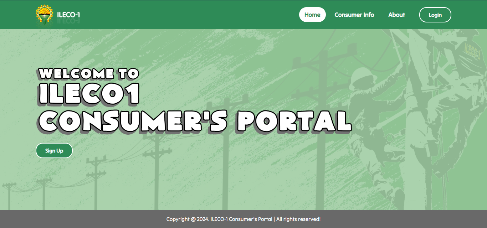

    

<h3 align="center">
Web - Based Consumers Portal
</h3>
 

A full-stack project that sole purpose is to make the services of 
   
  the said organization or company more reliable and can be access at ease.

 
 

## Getting Started

This is an example of how you may give instructions on setting up your project locally. To get a local copy up and running follow these simple example steps.

 

## About the Project

    

One of the challenges with building is time and configuration of the xampp and php file to send a OTP (one-time-pin) to the users email upon registration. 

 

However, the sole purpose of this project is to make the consumers of the said organization access their services without going in their office from time to time.

 

While there is a existing website of this organization but do not have a functionalities just like this project offers.
- This is their [company website](https://ileco1.com/) for your reference.

 

## Built With

This project was built with the following technologies:

- [Bootstrap](https://getbootstrap.com/)
- [Php](https://www.php.net/)
- [JavaScript]()
- [CSS]()
- [AJAX]()

### Installation

This project requires Xampp to be installed in your system. If you don't have it installed, you can follow these steps:

Install Xampp on your local machine

    Go to https://www.apachefriends.org/download.html

Configure Xampp

    to configure xampp follow these instructions

Xampp configuration instructions
   
      https://dev.to/naemazam/how-to-configure-xampp-to-send-mail-from-localhost-in-php--382c

## Contributing

Please read [CONTRIBUTING.md](CONTRIBUTING.md) for details on our code
of conduct, and the process for submitting pull requests to us.

## License

This project is licensed under the [CC0 1.0 Universal](LICENSE.md)
Creative Commons License - see the [LICENSE.md](LICENSE.md) file for
details

## Acknowledgments

- Hat tip to anyone whose code is used
- Inspiration
- etc

## Notice

This ReadMe was generated using makeread.me 🚀

